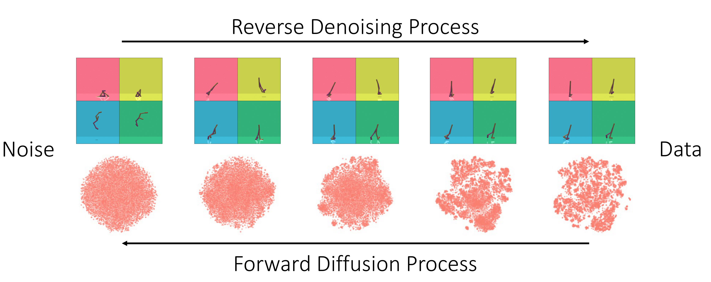

# Synthetic Experience Replay

[](https://twitter.com/cong_ml/status/1635642214586937346)
[](https://arxiv.org/abs/2303.06614)

<p align="center">
  
</p>

Synthetic Experience Replay (SynthER) is a diffusion-based approach to arbitrarily upsample an RL agent's collected
experience, leading to large gains in sample efficiency and scaling benefits. We integrate SynthER into a variety of
offline and online algorithms in this codebase, including SAC, TD3+BC, IQL, EDAC, and CQL. For further details, please
see the paper:

**_Synthetic Experience Replay_**; Cong Lu*, Philip J. Ball*, Yee Whye Teh, Jack Parker-Holder. Published at [NeurIPS, 2023](https://neurips.cc/virtual/2023/poster/72742).

<p align="center">
  <a href=https://arxiv.org/abs/2303.06614>View on arXiv</a>
</p>

## Setup

To install, clone the repository and run the following:

```bash 
git submodule update --init --recursive
pip install -r requirements.txt
```

The code was tested on Python 3.8 and 3.9.
If you don't have MuJoCo installed, follow the instructions here: https://github.com/openai/mujoco-py#install-mujoco.

## Running Instructions

### Offline RL

Diffusion model training (this automatically generates samples and saves them):

```bash
python3 synther/diffusion/train_diffuser.py --dataset halfcheetah-medium-replay-v2
```

Baseline without SynthER (e.g. on TD3+BC):

```bash
python3 synther/corl/algorithms/td3_bc.py --config synther/corl/yaml/td3_bc/halfcheetah/medium_replay_v2.yaml --checkpoints_path corl_logs/
```

Offline RL training with SynthER:

```bash
# Generating diffusion samples on the fly.
python3 synther/corl/algorithms/td3_bc.py --config synther/corl/yaml/td3_bc/halfcheetah/medium_replay_v2.yaml --checkpoints_path corl_logs/ --name SynthER --diffusion.path path/to/model-100000.pt

# Using saved diffusion samples.
python3 synther/corl/algorithms/td3_bc.py --config synther/corl/yaml/td3_bc/halfcheetah/medium_replay_v2.yaml --checkpoints_path corl_logs/ --name SynthER --diffusion.path path/to/samples.npz
```

### Online RL

Baselines (SAC, REDQ):

```bash
# SAC.
python3 synther/online/online_exp.py --env quadruped-walk-v0 --results_folder online_logs/ --exp_name SAC --gin_config_files 'config/online/sac.gin'

# REDQ.
python3 synther/online/online_exp.py --env quadruped-walk-v0 --results_folder online_logs/ --exp_name REDQ --gin_config_files 'config/online/redq.gin'
```

SynthER (SAC):

```bash
# DMC environments.
python3 synther/online/online_exp.py --env quadruped-walk-v0 --results_folder online_logs/ --exp_name SynthER --gin_config_files 'config/online/sac_synther_dmc.gin' --gin_params 'redq_sac.utd_ratio = 20' 'redq_sac.num_samples = 1000000'

# OpenAI environments (different gin config).
python3 synther/online/online_exp.py --env HalfCheetah-v2 --results_folder online_logs/ --exp_name SynthER --gin_config_files 'config/online/sac_synther_openai.gin' --gin_params 'redq_sac.utd_ratio = 20' 'redq_sac.num_samples = 1000000'
```

## Thinking of adding SynthER to your own algorithm?

Our codebase has everything you need for diffusion with low-dimensional data along with example integrations with RL algorithms.
For a custom use-case, we recommend starting from the training script and `SimpleDiffusionGenerator` class
in `synther/diffusion/train_diffuser.py`. You can modify the hyperparameters specified in `config/resmlp_denoiser.gin`
to suit your own needs.

## Additional Notes

- Our codebase uses `wandb` for logging, you will need to set `--wandb-entity` across the repository.
- Our pixel-based experiments are based on a modified version of the [V-D4RL](https://github.com/conglu1997/v-d4rl) repository. The latent representations are derived from the trunks of the [actor](https://github.com/conglu1997/v-d4rl/blob/55fde823f3ddb001dd439a701c74390eb3ac34fb/drqbc/drqv2.py#L82) and [critic](https://github.com/conglu1997/v-d4rl/blob/55fde823f3ddb001dd439a701c74390eb3ac34fb/drqbc/drqv2.py#L108C15-L108C15).

## Acknowledgements

SynthER builds upon many works and open-source codebases in both diffusion modelling and reinforcement learning. We
would like to particularly thank the authors of:

- [denoising-diffusion-pytorch](https://github.com/lucidrains/denoising-diffusion-pytorch/tree/main/denoising_diffusion_pytorch)
- [REDQ](https://github.com/watchernyu/REDQ)
- [CORL](https://github.com/tinkoff-ai/CORL)

## Contact

Please contact [Cong Lu](mailto:conglu97*AT*outlook*DOT*com) or [Philip Ball](mailto:ball*AT*robots*DOT*ox*DOT*ac*DOT*uk) for any queries.
We welcome any suggestions or contributions! 
